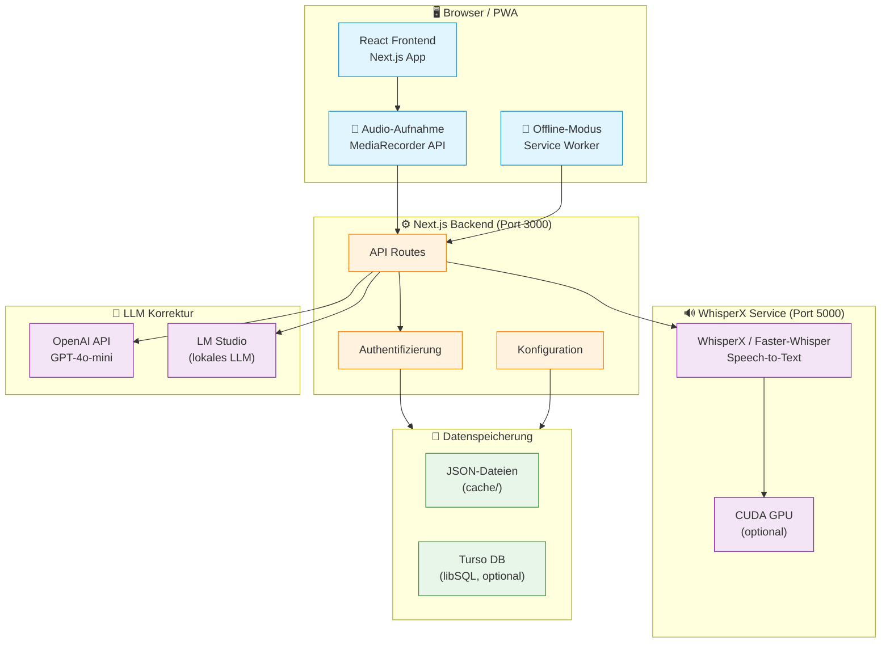
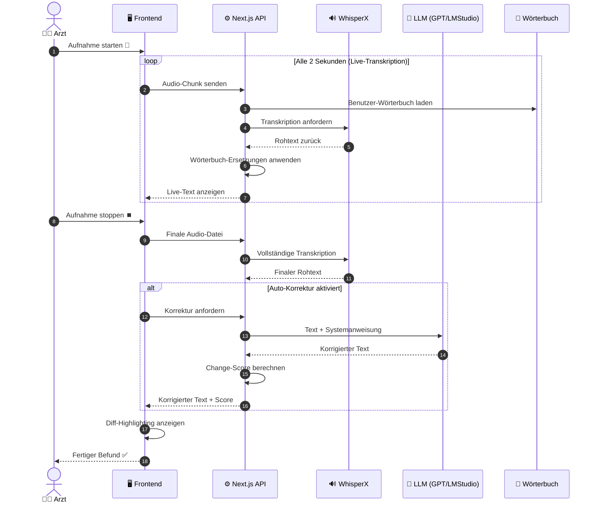
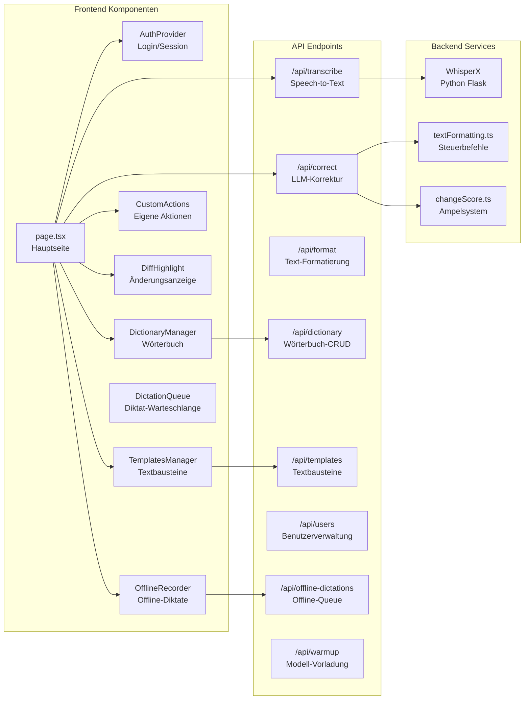
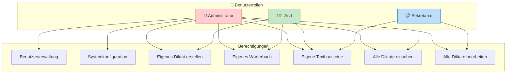
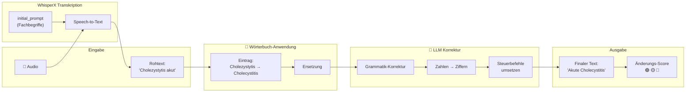
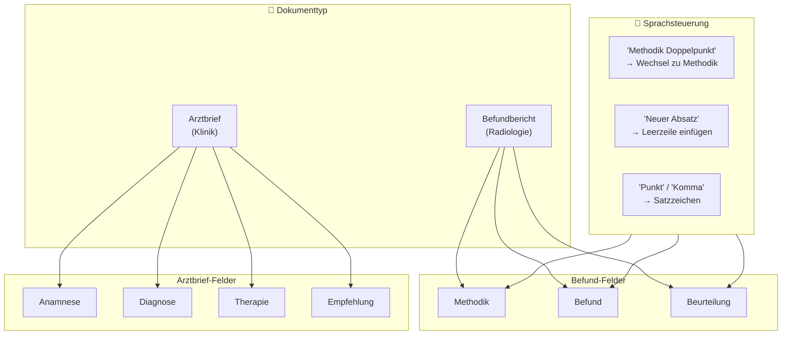
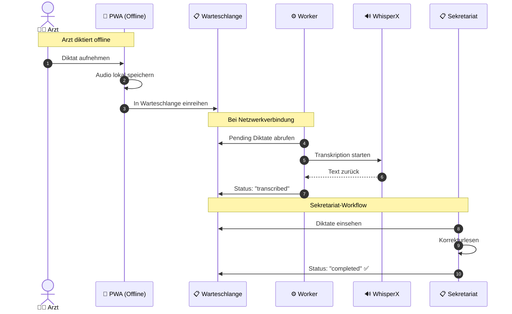
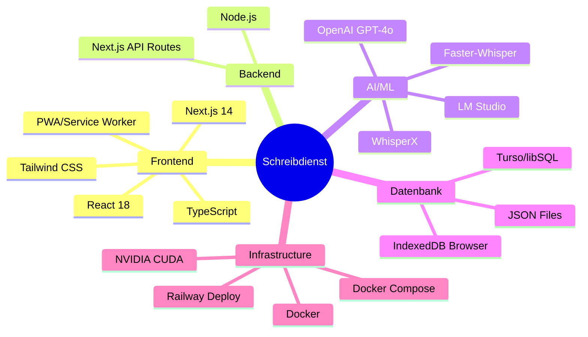
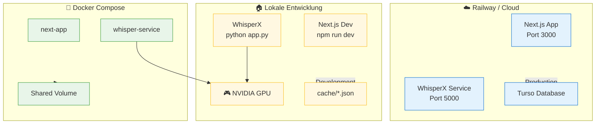
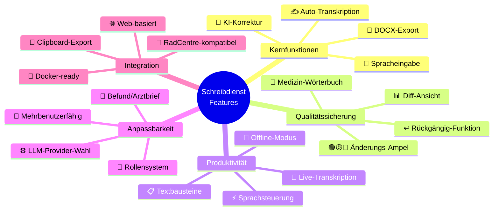

# Schreibdienst - Architektur & Funktionalitäten

## Übersicht

**Schreibdienst** ist eine Web-Applikation zur automatisierten Transkription und Korrektur medizinischer Diktate. Ärzte können per Spracheingabe Befundberichte und Arztbriefe erstellen, die automatisch transkribiert, korrigiert und formatiert werden.

---

## 1. Systemarchitektur (High-Level)

---

## 2. Haupt-Workflow: Diktat-Verarbeitung

---

## 3. Komponenten-Übersicht

---

## 4. Benutzer-Rollen & Berechtigungen

---

## 5. Datenfluss: Wörterbuch & Korrektur

---

## 6. Modi: Befundbericht vs. Arztbrief

---

## 7. Offline-Modus & Diktat-Warteschlange

---

## 8. Technologie-Stack

---

## 9. Deployment-Architektur

---

## 10. Feature-Übersicht für Entscheidungsträger

---

## Zusammenfassung

| Aspekt | Technologie/Lösung |
|--------|-------------------|
| **Frontend** | Next.js + React + TypeScript |
| **Speech-to-Text** | WhisperX (GPU-beschleunigt) |
| **KI-Korrektur** | OpenAI GPT-4o-mini / LM Studio |
| **Datenbank** | JSON-Files (lokal) / Turso (Cloud) |
| **Deployment** | Docker Compose / Railway |
| **Offline-Fähigkeit** | PWA mit Service Worker |

