# Schreibdienst - Architektur & Funktionalitäten

## Übersicht

**Schreibdienst** ist eine Web-Applikation zur automatisierten Transkription und Korrektur medizinischer Diktate. Ärzte können per Spracheingabe Befundberichte und Arztbriefe erstellen, die automatisch transkribiert, korrigiert und formatiert werden.

---

## 1. Systemarchitektur (High-Level)

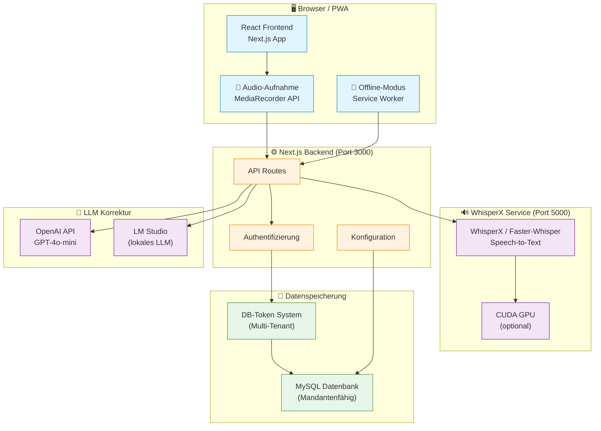

---

## 2. Haupt-Workflow: Diktat-Verarbeitung

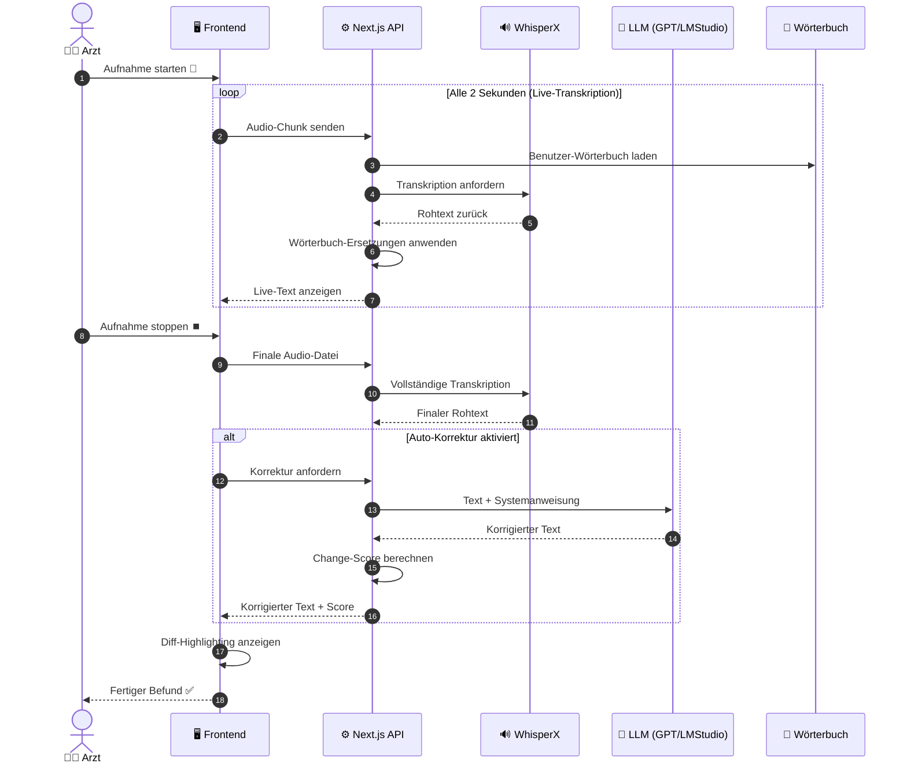

---

## 3. Komponenten-Übersicht

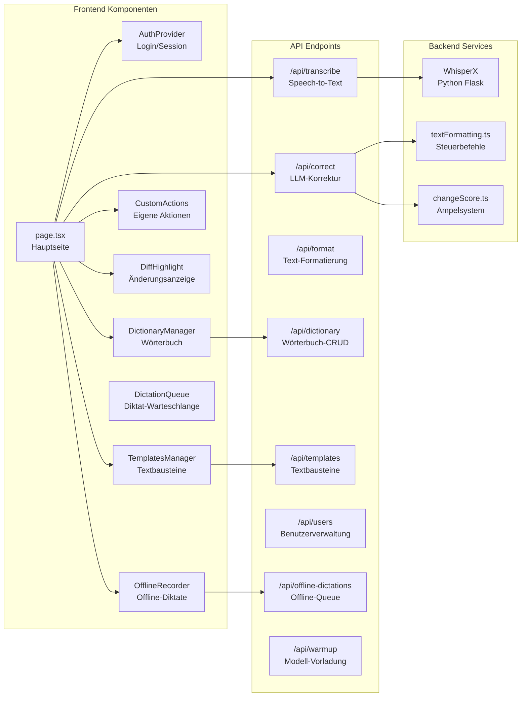

---

## 4. Benutzer-Rollen & Berechtigungen

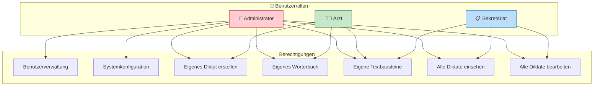

---

## 5. Mandantenfähigkeit: DB-Token System

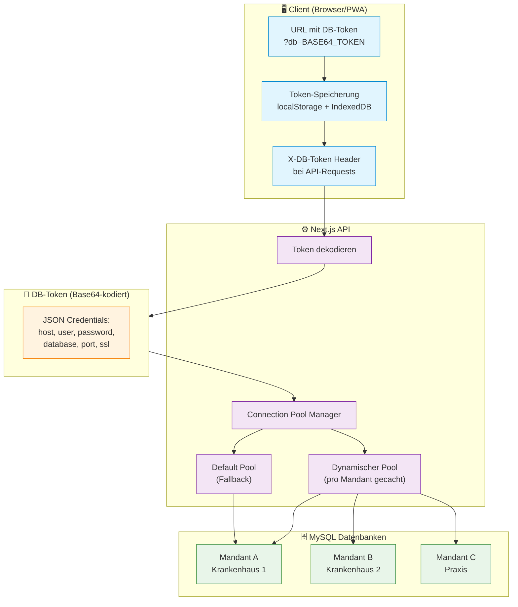

### Token-Format (Base64-kodiert):
```json
{
  "host": "mysql.example.com",
  "user": "schreibdienst_user",
  "password": "secret",
  "database": "mandant_a",
  "port": 3306,
  "ssl": true
}
```

### Vorteile des Token-Systems:
- **Keine Konfiguration am Server** - Mandant wird durch Token bestimmt
- **PWA-kompatibel** - Token in IndexedDB für Offline-Nutzung gespeichert
- **Flexible Deployment** - Eine App-Instanz, viele Mandanten
- **URL-basiert** - Token kann per Link weitergegeben werden

---

## 6. Datenfluss: Wörterbuch & Korrektur

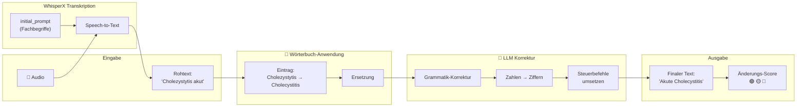

---

## 7. Modi: Befundbericht vs. Arztbrief

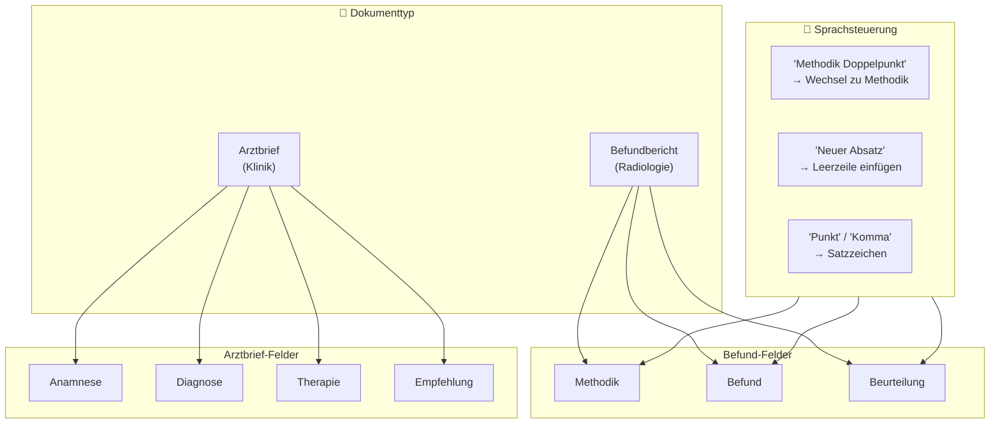

---

## 8. Online vs. Offline Diktat: Feature-Vergleich

### Übersicht der Unterschiede

```mermaid
flowchart TB
    subgraph Online["🌐 ONLINE-DIKTAT<br/>(Echtzeit-Verarbeitung)"]
        direction TB
        O1["🎤 Live-Aufnahme"]
        O2["👁️ Mitlesen in Echtzeit"]
        O3["📖 Wörterbuch-Korrektur"]
        O4["🤖 KI-Autokorrektur"]
        O5["🟢🟡🔴 Ampelsystem"]
        O6["📊 Diff-Highlighting"]
        O7["📋 Textbausteine"]
        O8["⚡ KI-Action-Module"]
        O9["✅ Sofort einsatzbereit"]
    end

    subgraph Offline["📴 OFFLINE-DIKTAT<br/>(Warteschlangen-Verarbeitung)"]
        direction TB
        F1["🎤 Aufnahme speichern"]
        F2["📁 Datei-Upload möglich"]
        F3["📋 Metadaten erfassen"]
        F4["⏳ Warteschlange"]
        F5["⚙️ Worker-Verarbeitung"]
        F6["👩‍💼 Sekretariat-Review"]
        F7["✅ Qualitätskontrolle"]
    end

    subgraph UseCase["Anwendungsfall"]
        UC1["Radiologe am Arbeitsplatz<br/>→ Online"]
        UC2["Arzt auf Visite<br/>→ Offline"]
        UC3["Externe Audiodatei<br/>→ Offline"]
    end

    Online --> UC1
    Offline --> UC2
    Offline --> UC3

    classDef online fill:#e8f5e9,stroke:#2e7d32
    classDef offline fill:#fff3e0,stroke:#f57c00
    classDef usecase fill:#e3f2fd,stroke:#1565c0

    class O1,O2,O3,O4,O5,O6,O7,O8,O9 online
    class F1,F2,F3,F4,F5,F6,F7 offline
    class UC1,UC2,UC3 usecase
```

### Online-Diktat: Echtzeit-Features

```mermaid
flowchart LR
    subgraph Recording["🎤 Aufnahme"]
        Mic["Mikrofon"]
        Chunk["Audio-Chunks<br/>(alle 2 Sek.)"]
    end

    subgraph LiveProcess["⚡ Live-Verarbeitung"]
        Whisper["WhisperX<br/>Transkription"]
        Dict["📖 Wörterbuch<br/>Ersetzungen"]
        Display["👁️ Mitlesen<br/>Live-Anzeige"]
    end

    subgraph PostProcess["🔧 Nach Aufnahme"]
        LLM["🤖 KI-Korrektur<br/>(GPT/LMStudio)"]
        Score["🟢🟡🔴 Ampel<br/>Change-Score"]
        Diff["📊 Diff-View<br/>Änderungen markiert"]
    end

    subgraph Enhance["✨ Erweiterungen"]
        Templates["📋 Textbausteine<br/>Vorlagen einfügen"]
        Actions["⚡ KI-Actions<br/>Custom Prompts"]
    end

    Mic --> Chunk
    Chunk --> Whisper
    Whisper --> Dict
    Dict --> Display
    Display --> LLM
    LLM --> Score
    Score --> Diff
    Diff --> Templates
    Templates --> Actions
```

### Feature-Details: Online-Modus

| Feature | Beschreibung | Nutzen |
|---------|-------------|--------|
| **👁️ Mitlesen** | Text erscheint während des Sprechens | Sofortige Kontrolle, Fehler erkennen |
| **📖 Wörterbuch** | Benutzer-spezifische Ersetzungen | Fachbegriffe korrekt schreiben |
| **🤖 KI-Korrektur** | Automatische Grammatik/Zahlen-Korrektur | Weniger manuelle Nacharbeit |
| **🟢🟡🔴 Ampel** | Visualisiert Umfang der KI-Änderungen | Vertrauen in Korrektur-Qualität |
| **📊 Diff-Highlighting** | Zeigt was die KI geändert hat | Transparenz, schnelle Prüfung |
| **📋 Textbausteine** | Vordefinierte Textblöcke pro Feld | Wiederkehrende Formulierungen |
| **⚡ KI-Actions** | Eigene KI-Prompts als Buttons | Erweiterbare Funktionalität |

### KI-Action-Module (Custom Actions)

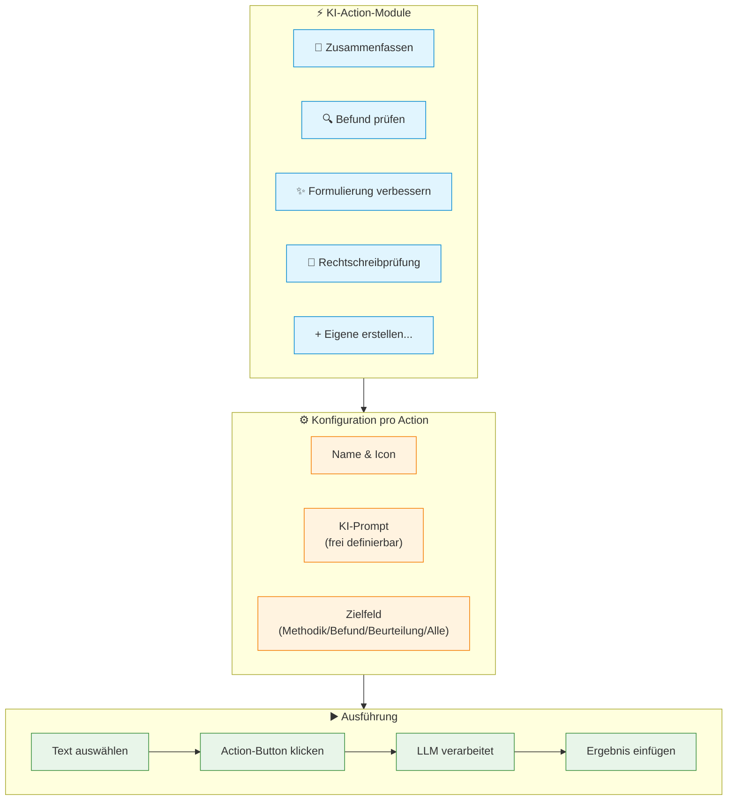

### Offline-Diktat: Warteschlangen-Workflow

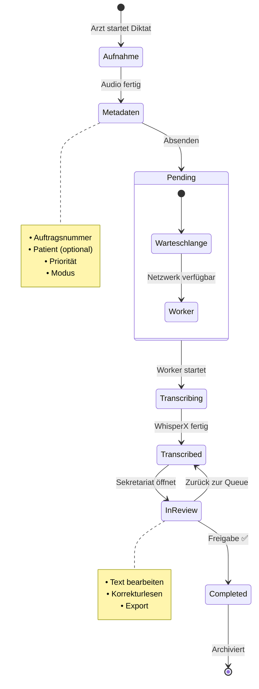

### Feature-Vergleich: Online vs. Offline

| Feature | 🌐 Online | 📴 Offline |
|---------|:---------:|:----------:|
| **Live-Transkription** | ✅ Alle 2 Sek. | ❌ Später |
| **Mitlesen** | ✅ Echtzeit | ❌ Nein |
| **Wörterbuch** | ✅ Sofort | ✅ Bei Verarbeitung |
| **KI-Korrektur** | ✅ Auto/Manuell | ❌ Nein |
| **Ampelsystem** | ✅ Ja | ❌ Nein |
| **Diff-Highlighting** | ✅ Ja | ❌ Nein |
| **Textbausteine** | ✅ Ja | ❌ Nein |
| **KI-Actions** | ✅ Ja | ❌ Nein |
| **Datei-Upload** | ❌ Nein | ✅ MP3/WAV/etc. |
| **Prioritäten** | ❌ Nein | ✅ Normal/Dringend/Sofort |
| **Sekretariat-Review** | ❌ Nein | ✅ Ja |
| **Offline-fähig** | ❌ Nein | ✅ PWA-Support |
| **Metadaten** | ❌ Nein | ✅ Patient, Auftrag |

---

## 10. Offline-Warteschlange: Detaillierter Ablauf

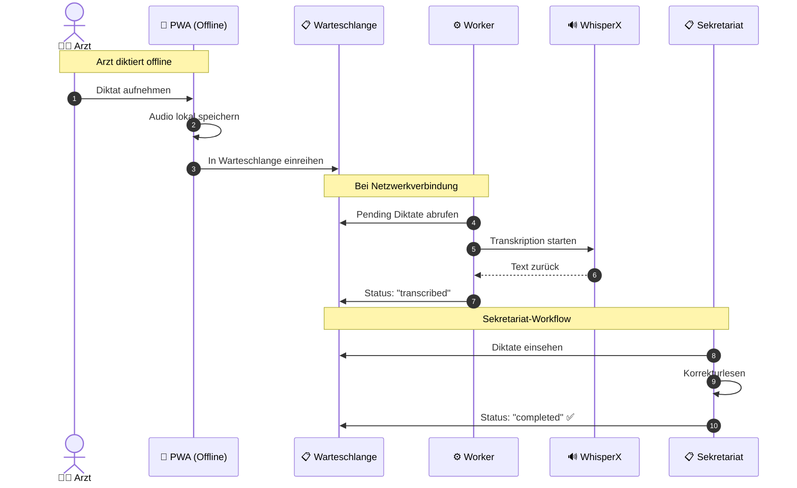

---

## 11. Technologie-Stack

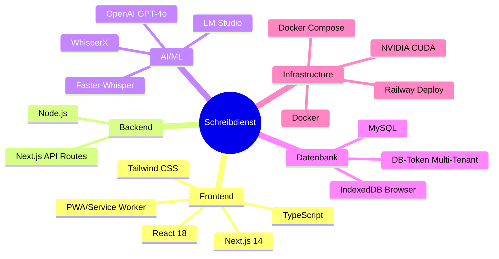

---

## 12. Deployment-Architektur

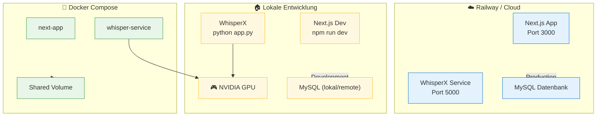

---

## 13. Feature-Übersicht für Entscheidungsträger

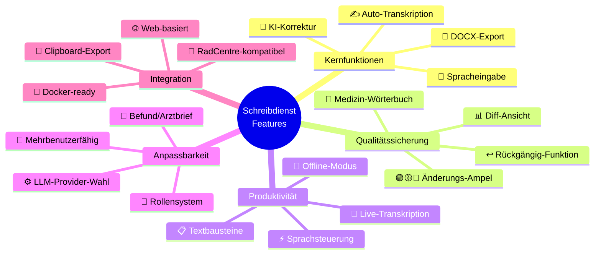

---

## Zusammenfassung

| Aspekt | Technologie/Lösung |
|--------|-------------------|
| **Frontend** | Next.js + React + TypeScript |
| **Speech-to-Text** | WhisperX (GPU-beschleunigt) |
| **KI-Korrektur** | OpenAI GPT-4o-mini / LM Studio |
| **Datenbank** | MySQL (mandantenfähig via DB-Token) |
| **Mandantenfähigkeit** | Token-basiert (Multi-Tenant) |
| **Deployment** | Docker Compose / Railway |
| **Offline-Fähigkeit** | PWA mit Service Worker |

